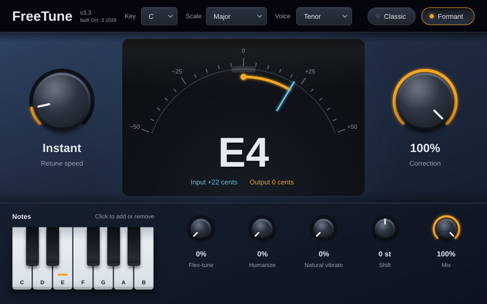

# FreeTune

A free, open-source real-time pitch correction plugin (VST3) for vocals and other monophonic sources, built with JUCE.

## What it does

FreeTune listens to a single voice, works out which note the singer is aiming for, and pulls the pitch onto that note in real time. Use it subtly to tighten a performance, or set the retune speed to zero for the hard, stepped "robot" effect.

- **Key and scale**: all 12 keys in major or minor, chromatic, or any custom set of notes from the on-screen keyboard
- **Retune speed**: from an instant snap to a slow, natural glide that keeps the singer's vibrato
- **Correction**: how much of the pitch error gets corrected
- **Flex-tune**: leaves deliberate bends and slides alone, corrects only near the target note
- **Humanize**: eases off correction on long sustained notes
- **Natural vibrato**: reduces correction on wide vibrato
- **Shift**: transpose by up to ±12 semitones
- **Formant preservation**: keeps vowels sounding natural instead of chipmunk-like when shifting
- **Classic mode**: instant, aggressive snapping on every note
- **Breath and consonant handling**: unvoiced sounds pass through unprocessed
- **Live tuning meter**: shows the singer's pitch and the corrected result in cents
- **Mix**: blend between dry and corrected signal

## Download and install (Windows)

1. Download the latest `FreeTune-vX.X-Windows-VST3.zip` from the [Releases](../../releases) page and unzip it.
2. Copy the `FreeTune.vst3` folder into `C:\Program Files\Common Files\VST3\`.
3. In your DAW, rescan plugins (in FL Studio: Options → Manage plugins → Find installed plugins).

FreeTune is a mono effect: put it on a dry vocal track before reverb and delay.

## Quick start

- Set **Key** and **Scale** to match your song.
- For natural correction: Retune speed around 20–60 ms, Correction 80–100%.
- For the hard-tuned effect: turn on **Classic**, or set Retune speed to Instant.
- Double-click any knob to reset it.

## Latency

FreeTune analyses about 46 ms of audio (2048 samples at 44.1/48 kHz) and reports that latency to the host, so DAWs with delay compensation keep it in sync. When monitoring live through the plugin you will hear that delay.

## Building from source

Requirements: [JUCE](https://juce.com) 8 or newer, the Projucer, and Visual Studio 2022 or newer.

1. Open `FreeTune.jucer` in the Projucer.
2. Make sure the `juce_dsp` module is enabled (Modules panel).
3. Click "Save and Open in IDE", then build the `FreeTune_VST3` target in the Release configuration.
4. The plugin is written to `Builds/VisualStudio20xx/x64/Release/VST3/FreeTune.vst3`.

Only Windows builds have been tested so far.

## How it works

- **Pitch detection**: YIN algorithm (cumulative-mean-normalised difference function computed via FFT autocorrelation), with a 3-frame median filter.
- **Note selection**: nearest note in the active scale, with hysteresis so the target doesn't flip between two notes.
- **Correction**: the correction amount glides toward its target per sample, so slow retune speeds keep natural vibrato.
- **Pitch shifting**: pitch-synchronous overlap-add with sub-sample grain timing and cubic interpolation.
- **Formants**: adaptive lattice LPC pre/post filtering, based on Autotalent's formant corrector.
- **Voicing gate**: YIN clarity with hysteresis cross-fades unvoiced sounds back to the dry signal.

## Credits

FreeTune's DSP core is derived from **Autotalent** by Tom Baran (GPL v2 or later), substantially reworked. Built with the **JUCE** framework. See [NOTICE.md](NOTICE.md) for details.

## License

FreeTune is licensed under the **GNU Affero General Public License v3.0**. See [LICENSE](LICENSE).

Auto-Tune is a trademark of Antares Audio Technologies. FreeTune is an independent project and is not affiliated with or endorsed by Antares.
